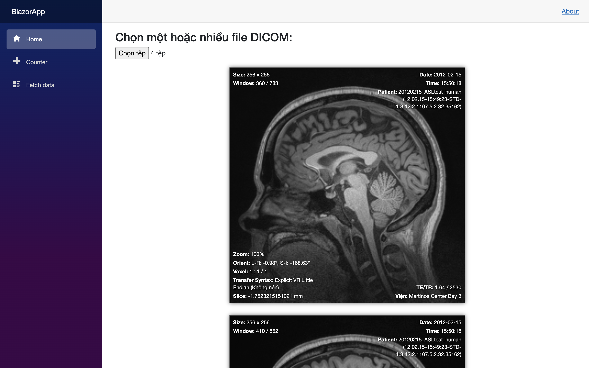
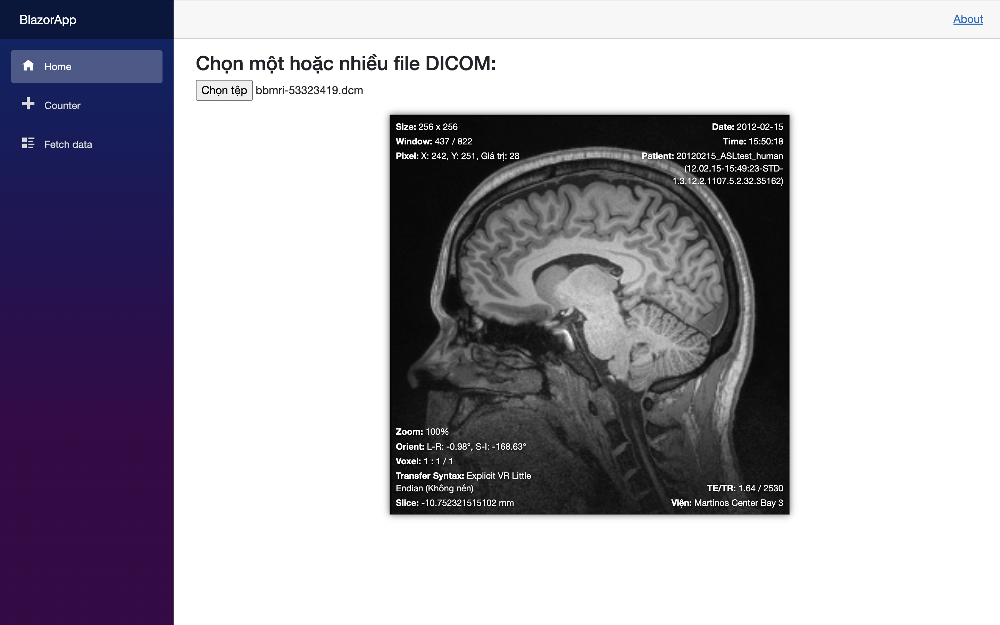
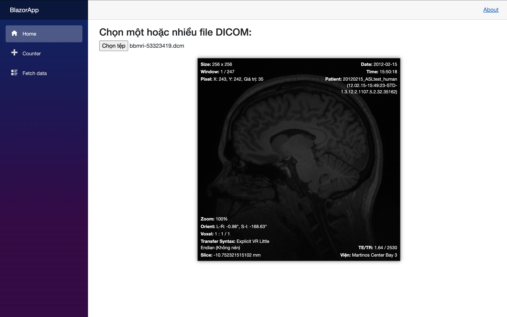
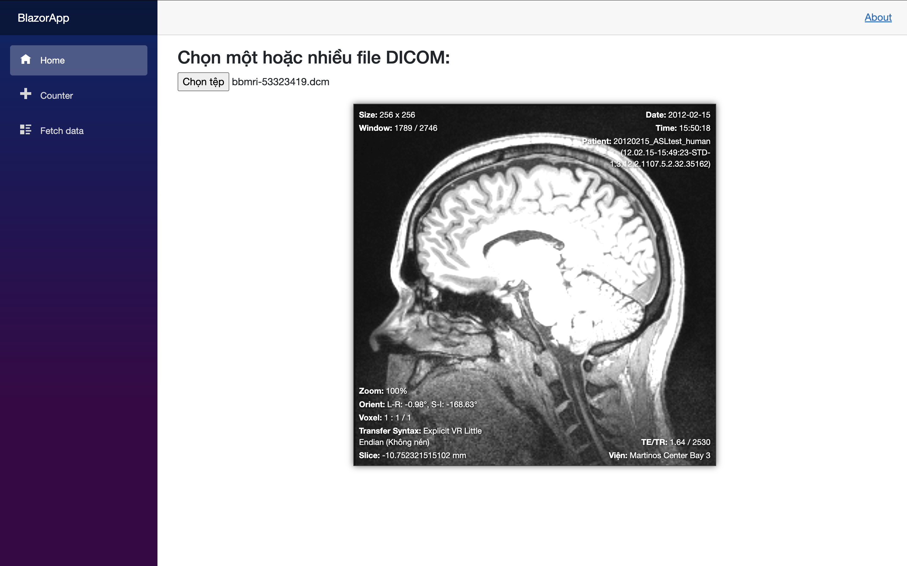
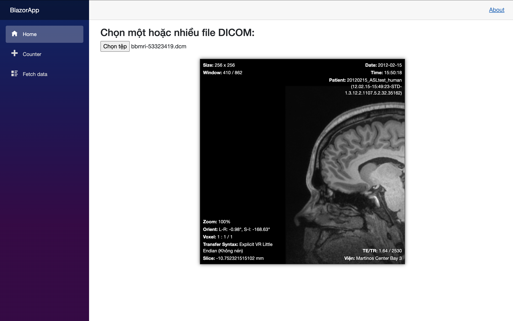
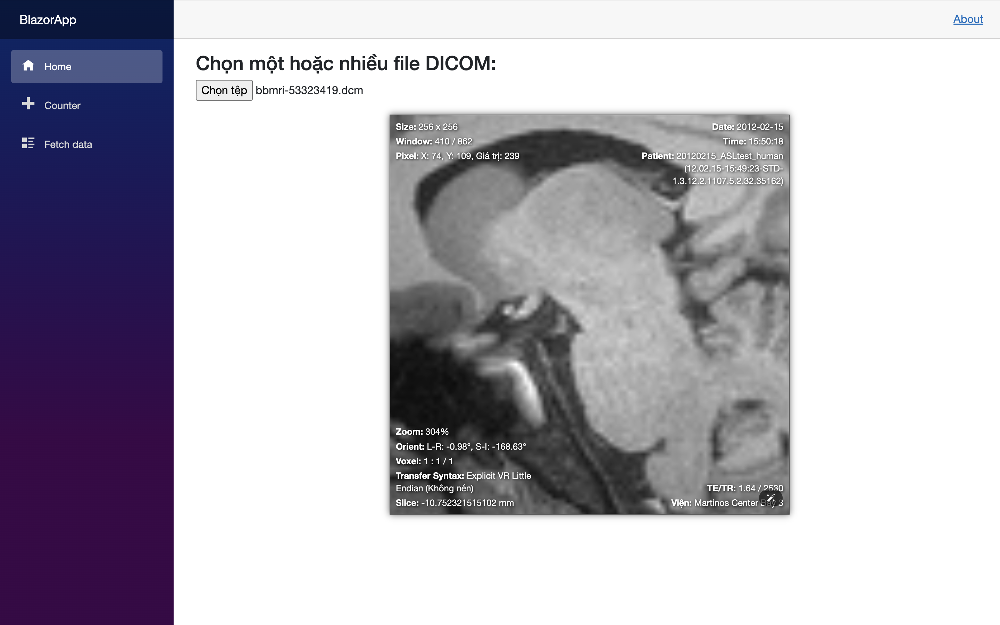
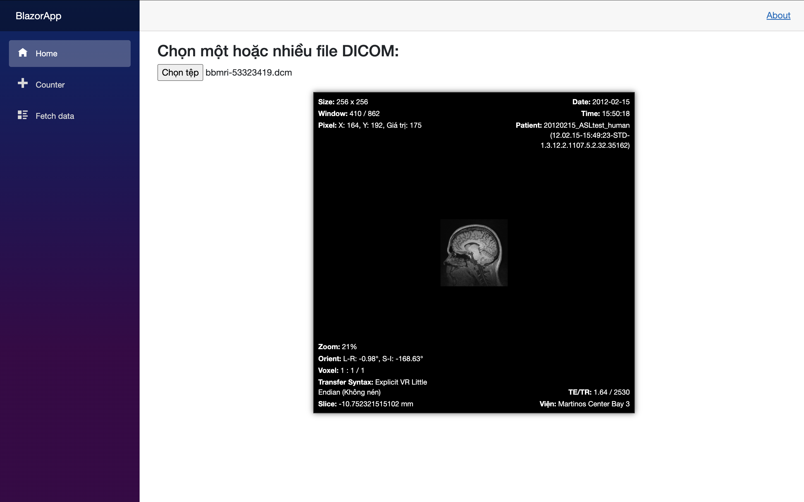
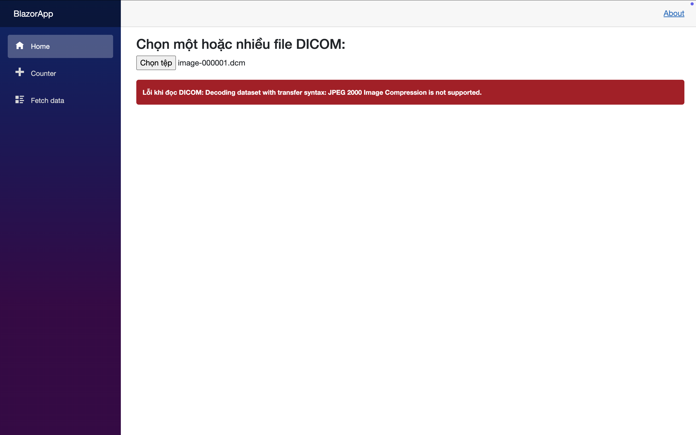

# 🩻 BlazorApp - Demo DICOM Viewer

## 📘 Mô tả
Ứng dụng Blazor đơn giản dùng để demo tính năng tải file DICOM lên và xử lý hiển thị cơ bản (bao gồm windowing, pan, zoom, tọa độ pixel...).

---

## 🚀 Cách chạy ứng dụng

### ✅ Yêu cầu
- [.NET SDK 8.0](https://dotnet.microsoft.com/en-us/download/dotnet/8.0) hoặc 9.0 trở lên.
- Terminal hoặc IDE như Visual Studio / VS Code.

### ▶️ Hướng dẫn chạy

```bash
# Bước 1: Build project
dotnet build

# Bước 2: Chạy ứng dụng
dotnet run
````

> Mở trình duyệt và truy cập địa chỉ được in ra (mặc định là `https://localhost:5001` hoặc `http://localhost:5000`).

---

## Mô tả hoạt động

### File: `Không nén`
---

Chọn *file DICOM bất kỳ*
hoặc sử dụng các *file mẫu* trong thư mục: wwwroot/dicomfiles/*.dcm



---

### Rê chuột

Hiển thị: `Pixel`, Ví dụ: **Pixel: X: 73, Y: 30, Giá trị: 22**



---

### Rê chuột + Giữ chuột trái

Hiển thị `Pixel`, Ví dụ: **Pixel: X: 73, Y: 30, Giá trị: 22**

Thay đổi `Window`, Ví dụ: **Window: 275 / 1063** 

| Kéo xuống Tối dần                                | Kéo lên Sáng dần                                 |
| ------------------------------------------ | ------------------------------------------- |
|  |  |

---

### Rê chuột + Giữ chuột giữa

Di chuyển hình ảnh *(pan)* trong khung hiển thị.



---

### Rê chuột + Giữ chuột phải

Zoom ảnh to/nhỏ.

| Kéo xuống Zoom to                               | Kéo lên Zoom nhỏ                                 |
| ------------------------------------------ | ------------------------------------------- |
|  |  |

---

---

### File: **Nén (JPEG2000)**

> Trên **MacOS** chưa hỗ trợ đọc file DICOM nén (JPEG2000...) vì thiếu thư viện native.

